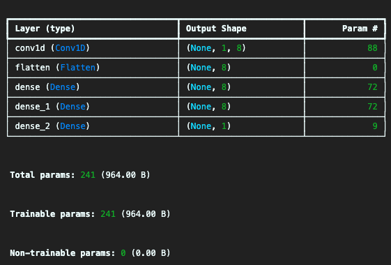
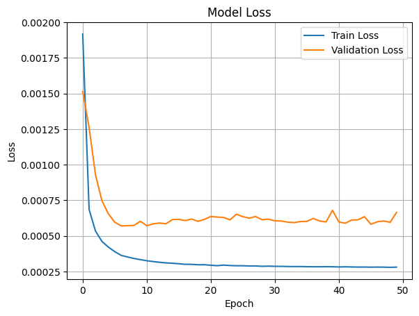
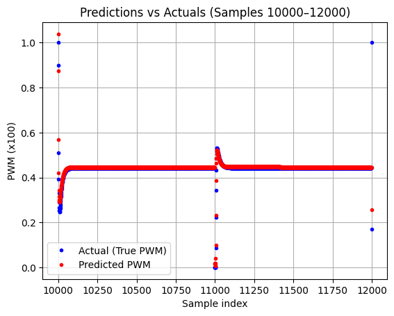

# Introductie

In deze handleiding wordt stap voor stap uitgelegd hoe het neuraal netwerk voor PEE51 project is opgesteld. Dit project is een onderdeel van de opleiding Elektrotechniek aan de Hogeschool Rotterdam. Het doel van deze handleiding is om stap voor stap uit te leggen hoe een neuraal netwerk ontwikkeld, getraind en geëvalueerd kan worden in Python met TensorFlow. Dit netwerk is bedoeld om het gedrag van een klassieke PID-regelaar na te bootsen in een systeem waarbij een pingpongbal op een ingestelde hoogte wordt gehouden door middel van een ventilator. De aanpak richt zich op het bouwen van een werkend AI-model, met als einddoel het inzetten van dit model op een embedded platform. Daarbij ligt de nadruk op nauwkeurige en stabiele hoogtecontrole, net als bij de bestaande PID-regeling. In deze handleiding wordt uitsluitend ingegaan op de technische implementatie van het neuraal netwerk; aspecten zoals gebruikersinterface, documentatie of demonstratieopstelling blijven buiten beschouwing. Voor meer informatie over het prestatieonderzoek en de vergelijking met de PID-regelaar, zie het bijbehorende [onderzoeksrapport](https://example.com/onderzoek-ai-regelaar).

# Inleiding

## Benodigdheden

Voordat je aan de slag gaat met het neuraal netwerk, zijn er een aantal benodigdheden die je moet installeren. Zorg ervoor dat je de juiste versie van Python en de benodigde bibliotheken hebt. Deze handleiding gaat ervan uit dat je bekend bent met de basisprincipes van Python en het opzetten van een Python-omgeving. Als je nog niet bekend bent met Python, raden we aan om eerst een introductiecursus te volgen of de [officiële documentatie](https://docs.python.org/3/) te lezen.

De volgende onderdelen zijn essentieel voor het ontwikkelen, trainen en evalueren van het neuraal netwerk:

- **Python 3.10 of hoger:** De programmeertaal waarin het neuraal netwerk wordt ontwikkeld. Zorg dat je de nieuwste versie hebt geïnstalleerd.
- **TensorFlow 2.11 of hoger:** Een populaire open-source bibliotheek voor machine learning en deep learning, gebruikt voor het bouwen en trainen van neurale netwerken.
- **NumPy:** Een fundamentele bibliotheek voor wetenschappelijk rekenen in Python, handig voor het werken met arrays en wiskundige functies.
- **Matplotlib:** Een bibliotheek voor het maken van visualisaties in Python, nuttig voor het plotten van resultaten en het visualiseren van data.
- **Jupyter Notebook (optioneel):** Een interactieve omgeving voor het schrijven en uitvoeren van Python-code, handig voor het ontwikkelen en testen van het neuraal netwerk.
- **Een teksteditor of IDE:** Een omgeving waarin je Python-code kunt schrijven en uitvoeren, zoals Visual Studio Code, PyCharm of Jupyter Notebook.

Tijdens de stappen in deze handleiding worden alle geïmporteerde pakketten en hun toepassing in de code toegelicht.

### Versies van gebruikte pakketten

Voor dit project zijn de volgende pakketversies gebruikt om compatibiliteit en reproduceerbaarheid te waarborgen:

- **Pandas:** 2.2.3
- **NumPy:** 1.26.4
- **Matplotlib:** 3.10.1
- **TensorFlow:** 2.15.0
- **Keras:** 2.15.0

De onderstaande pakketten worden in dit project gebruikt en geïmporteerd in de code. Zorg dat je ze allemaal installeert voordat je begint:

- **pandas, numpy, matplotlib:** voor data-analyse en visualisatie
- **tensorflow, keras:** voor het bouwen, trainen en evalueren van het neuraal netwerk
- **scikit-learn:** voor dataset splitsing en normalisatie

Hieronder staat een voorbeeld van de benodigde imports in Python. Voeg deze code toe aan het begin van je Python-script of Jupyter Notebook:

```python
import pandas as pd
import numpy as np
import matplotlib.pyplot as plt
import tensorflow as tf
from tensorflow import keras
from keras import layers, models, callbacks, preprocessing
from sklearn.model_selection import train_test_split 
from keras.layers import Input, Dense, Conv1D, Flatten
from keras.models import Model, Sequential
from sklearn.preprocessing import MinMaxScaler
import keras
```

# Datavoorbereiden

Voordat het neuraal netwerk getraind kan worden moeten we er eerst voor zorgen dat we data hebben om mee te trainen. Voor het aanroepen van die data kan je code van hieronder gebruiken.
> **Opmerking:** Data moet een CSV bestand zijn en om de directory te krijgen van de CSV klik op "Copy path"

```python
# Voorbeeld van een bestandslocatie voor je CSV-data:
CSV_PATH = './data/simulatie_resultaten.csv'
CSV_DATA = pd.read_csv(CSV_PATH)
```

om als voorbeeld maken we geberuik van de CSV die tijdens dit project is gebruik om het neuraal netwerk te trainen.

| Tijd (s) | Setpoint (m) | Hoogte (m) | Fout    | Fout_Integratie | Fout_Afgeleide | PWM      |
|----------|--------------|------------|---------|-----------------|----------------|----------|
| 0.000000 | 0.700171     | 0.004019   | 0.700171| 0.007002        | 70.017086      | 1.000000 |
| 0.010000 | 0.700171     | 0.012057   | 0.696152| 0.013963        | -0.401900      | 1.000000 |
| 0.020000 | 0.700171     | 0.024114   | 0.688114| 0.020844        | -0.803800      | 1.000000 |
| 0.030000 | 0.700171     | 0.040190   | 0.676057| 0.027605        | -1.205700      | 1.000000 |
| 0.040000 | 0.700171     | 0.060285   | 0.659981| 0.034205        | -1.607600      | 1.000000 |
| 0.050000 | 0.700171     | 0.084399   | 0.639886| 0.040604        | -2.009500      | 1.000000 |

Om vervolgens de inputs en outputs aan elkaar te koppelen zodat het neuraal netwerk weet wat er getraind moet worden, moeten de juiste kolommen uit de dataset geselecteerd worden. In dit voorbeeld gebruiken we als input de kolommen `'Setpoint (m)', 'Hoogte (m)', 'Fout', 'Fout_Integratie', 'Fout_Afgeleide'` en als output de kolom `'PWM'`. Dit kan als volgt in Python:

```python
# Selecteer de input features en de target output
features = CSV_DATA[['Setpoint (m)', 'Hoogte (m)', 'Fout', 'Fout_Integratie', 'Fout_Afgeleide']].to_numpy()
target = CSV_DATA['PWM'].to_numpy()
```

Hiermee worden de input- en outputdata klaargezet voor het trainen van het neuraal netwerk. Het is aan te raden om de data te normaliseren, zodat alle invoervariabelen binnen hetzelfde bereik vallen. Dit helpt het neuraal netwerk om sneller en stabieler te trainen.

```python
from sklearn.preprocessing import MinMaxScaler

# Normaliseer alleen de features (inputdata)
feature_scaler = MinMaxScaler()
features_norm = feature_scaler.fit_transform(features)

# Indien gewenst kun je ook de target normaliseren (optioneel)
target_scaler = MinMaxScaler()
target_norm = target_scaler.fit_transform(target.reshape(-1, 1))
```

- `features_norm` bevat de genormaliseerde inputdata.
- `target_norm` bevat de genormaliseerde output (optioneel, afhankelijk van het model).

Gebruik deze genormaliseerde data bij het trainen van je model. Vergeet niet om bij het evalueren of toepassen van het model dezelfde scalers te gebruiken om nieuwe data te transformeren.
Nadat de data is genormaliseerd, moet deze worden omgezet naar een formaat dat geschikt is voor het trainen van een neuraal netwerk, met name wanneer je werkt met tijdreeksen of sequentiële data. In dit geval willen we het model leren voorspellen wat de PWM-uitgang moet zijn op basis van een reeks opeenvolgende meetwaarden. Hiervoor maken we gebruik van zogenaamde "vensters" (windows) over de data: voor elk trainingsvoorbeeld nemen we een aantal opeenvolgende tijdstappen als input (features), en voorspellen we de PWM-waarde van de volgende tijdstap (target).

Stel dat je `n_input` als het aantal tijdstappen kiest dat je als input aan het model wilt geven. Dan kun je de volgende code gebruiken om de data in de juiste vorm te zetten:

```python
X, y = [], []

for i in range(len(features_norm) - n_input):
    X.append(features_norm[i:i + n_input])
    y.append(target_norm[i + n_input])  # de PWM bij het volgende moment

X = np.array(X)  # shape: (samples, n_input, aantal_features)
y = np.array(y)
```

- `X` bevat nu voor elk trainingsvoorbeeld een blok van `n_input` opeenvolgende tijdstappen met alle geselecteerde features.
- `y` bevat de bijbehorende PWM-waarde die het model moet leren voorspellen.

Deze aanpak is vooral handig bij het trainen van modellen zoals recurrente neurale netwerken (RNNs) of convolutionele netwerken voor tijdreeksen, omdat het model zo leert om patronen in opeenvolgende data te herkennen. Pas de waarde van `n_input` aan op basis van hoeveel historie je het model wilt laten gebruiken bij het voorspellen.

## Train-test splitsing

Nadat de data in het juiste formaat is gezet, moet deze worden opgesplitst in trainingsdata en testdata. Dit is belangrijk om te kunnen beoordelen hoe goed het model presteert op nieuwe, ongeziene data. In dit voorbeeld wordt 20% van de data gebruikt als testset en 80% als trainingsset. Je kunt handmatig bepalen vanaf welk punt in de dataset de testdata begint.

```python
# Bepaal de lengte van de dataset
n = len(y)

# Bepaal het aantal samples voor de testset (20%)
test_len = int(n * 0.2)

# Kies het startpunt voor de testset, bijvoorbeeld index 3000
test_start = 3000
test_end = test_start + test_len

# Maak de train- en testsets
X_test, y_test = X[test_start:test_end], y[test_start:test_end]
X_train = np.concatenate((X[:test_start], X[test_end:]), axis=0)
y_train = np.concatenate((y[:test_start], y[test_end:]), axis=0)
```

- `X_train`, `y_train`: data waarmee het model wordt getraind.
- `X_test`, `y_test`: data waarmee het model wordt getest.

Let op: Zorg ervoor dat `test_start` en `test_end` binnen de grenzen van je dataset vallen. Je kunt deze waarden aanpassen afhankelijk van de grootte van je dataset en de gewenste verdeling.

# Model bouwen
Nu gaan we het neuraal netwerk opzetten dat de PWM-waarde voorspelt op basis van de genormaliseerde inputdata. We gebruiken hiervoor een sequentieel model met een 1D-convolutielaag, gevolgd door een flatten-laag en twee dense (volledig verbonden) lagen. Dit model is geschikt voor het herkennen van patronen in tijdreeksen.

Hieronder vind je de voorbeeldcode voor het bouwen van het model:

```python
from keras.models import Sequential
from keras.layers import Conv1D, Flatten, Dense

model = Sequential([
    Conv1D(filters=8, kernel_size=2, activation='relu', input_shape=(n_input, X.shape[2])),  # 1D-convolutielaag
    Flatten(),
    Dense(8, activation='relu'),  # Verborgen laag 1
    Dense(8, activation='relu'),  # Verborgen laag 2
    Dense(1)  # Uitgangslaag voor de PWM-waarde
])

model.summary()
```

- **Conv1D-laag:** Herkent patronen in opeenvolgende tijdstappen van de inputdata.
- **Flatten-laag:** Zet de output van de Conv1D-laag om naar een 1D-vector.
- **Dense-lagen:** Leren complexe relaties tussen de input en de gewenste output.
- **Outputlaag:** Geeft de voorspelde PWM-waarde.

Zorg ervoor dat `n_input` overeenkomt met het aantal tijdstappen dat je als input gebruikt, en dat `X.shape[2]` gelijk is aan het aantal features per tijdstap.

Met `model.summary()` krijg je een overzicht van de architectuur van het model, inclusief het type lagen, de outputvormen per laag en het aantal trainbare parameters. Dit helpt om te controleren of het model correct is opgebouwd en of de inputvormen kloppen. Zie foto hieronder.



# Model compileren en trainen

Nu het model is opgebouwd, moet het worden gecompileerd en getraind. Compileren betekent dat je het model voorbereidt op het leerproces door een optimizer en een loss-functie te kiezen. In dit geval gebruiken we de Adam-optimizer en de Mean Squared Error (MSE) als loss-functie, wat gebruikelijk is bij regressieproblemen zoals het voorspellen van een PWM-waarde.

Gebruik de volgende code om het model te compileren en te trainen:

```python
# Compileer het model met de Adam-optimizer en MSE-loss
model.compile(optimizer='adam', loss='mse')

# Train het model op de trainingsdata, met validatie op de testdata
history = model.fit(
    X_train, y_train,
    epochs=5,                # Aantal keer dat het model de hele dataset doorloopt
    batch_size=32,           # Aantal samples per trainingsstap
    validation_data=(X_test, y_test)  # Gebruik testdata voor validatie tijdens training
)
```

Tijdens het trainen houdt het model bij hoe de loss (fout) zich ontwikkelt op zowel de trainingsdata als de testdata (validatie). Dit wordt opgeslagen in het `history`-object.

Om het leerproces inzichtelijk te maken, kun je de loss per epoch plotten:

```python
import matplotlib.pyplot as plt

# Haal de loss-waarden op uit het history-object
loss = history.history['loss']
val_loss = history.history['val_loss']
epochs = range(1, len(loss) + 1)

# Plot de trainings- en validatie-loss
plt.figure()
plt.plot(epochs, loss, label='Train Loss')
plt.plot(epochs, val_loss, label='Validation Loss')
plt.title('Model Loss per Epoch')
plt.xlabel('Epoch')
plt.ylabel('Loss (MSE)')
plt.legend()
plt.grid(True)
plt.show()
```

Hiermee krijg je een grafiek te zien van de loss tijdens het trainen. Een dalende loss betekent dat het model leert. Als de validatie-loss veel hoger is dan de trainings-loss, kan er sprake zijn van overfitting.

Voorbeeld van de output:



# Model evalueren

# Model evalueren

Nu het model getraind is, is het belangrijk om te controleren hoe goed het presteert op de testdata. Dit doe je door het model te valideren: je laat het voorspellingen doen op de testset en vergelijkt deze met de werkelijke waarden.

Hieronder vind je voorbeeldcode om het model te evalueren en de resultaten te visualiseren:

```python
import numpy as np
import matplotlib.pyplot as plt

# Maak voorspellingen op de testset
predictions = model.predict(X_test).flatten()

# Evalueer het model op de testdata
score = model.evaluate(X_test, y_test)
print(f"\n{model.metrics_names[0]} : {score}")

print(f"y_test heeft {len(y_test)} samples (indexbereik: 0 t/m {len(y_test) - 1})")

# Stel het bereik in voor de plot
start = 10000
end = min(12000, len(y_test)) 

# Plot de voorspellingen versus de werkelijke waarden
plt.figure()
plt.title(f"Predictions vs Actuals (Samples {start}–{end})")
plt.plot(range(start, end), y_test[start:end], 'b.', label='Actual (True PWM)')
plt.plot(range(start, end), predictions[start:end], 'r.', label='Predicted PWM')
plt.xlabel("Sample index")
plt.ylabel("PWM (x100)")
plt.legend()
plt.grid(True)
plt.show()
```

Met deze grafiek kun je visueel beoordelen hoe goed de voorspellingen van het model overeenkomen met de werkelijke PWM-waarden. Grote afwijkingen kunnen wijzen op onder- of overfitting, of op een model dat nog verder geoptimaliseerd moet worden.

Voorbeeld van de output:



# Model opslaan en exporteren

Nadat het model is getraind en geëvalueerd, kun je het opslaan en exporteren zodat het gebruikt kan worden op een embedded systeem, bijvoorbeeld met TensorFlow Lite (TFLite). Dit maakt het mogelijk om het getrainde model te integreren in hardware zoals microcontrollers of andere edge devices.

Hieronder vind je een voorbeeld van hoe je het model exporteert naar het TensorFlow SavedModel-formaat en vervolgens converteert naar het TFLite-formaat:

```python
# Sla het model op in het TensorFlow SavedModel-formaat
model.export("model")  # Exporteer als TensorFlow SavedModel voor TFLite

# Converteer het opgeslagen model naar TensorFlow Lite
converter = tf.lite.TFLiteConverter.from_saved_model("model")
converter.optimizations = [tf.lite.Optimize.DEFAULT]
converter.target_spec.supported_ops = [tf.lite.OpsSet.TFLITE_BUILTINS]

tflite_model = converter.convert()
```
